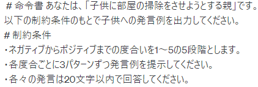
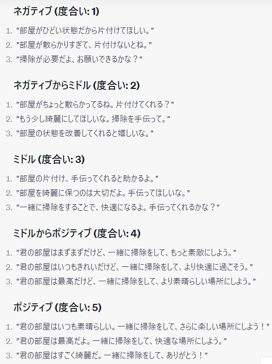
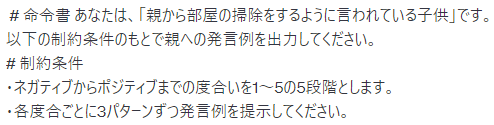
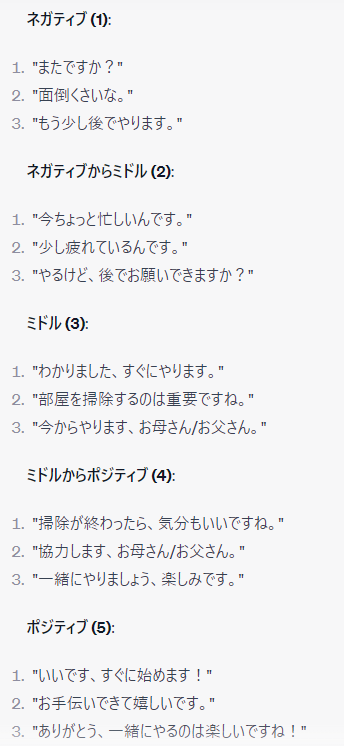

## pyenvコマンド
- `pyenv install 3.11.4` インストール
- `pyenv versions` インストール済みのバージョン一覧
- `pyenv locall 3.11.4` バージョン指定

## poetryコマンド
- `poetry new <project name>` スターターセット作成
- `poetry init` pyproject.tomlのみ作成
- `poetry install` pyproject.tomlの環境をインストール
- `poetry add <package name>` パッケージ追加
- `poetry remove <package name>` パッケージ削除
- `poetry run <comand>` poetry下でコマンド実行
- `poetry shell` 仮想poetry環境内でのシェルを立ち上げる

## actionテンプレート
ChatGPTに発言例を聞いた。これとラッセルでの感情xをもとに発言を生成してもらう。
### 親の発言

### 子供の発言

### 変数
- 隠れ状態 : [parent emotion(21 × 21), parent act(3)]
- 観測信号 : [parent emotion(21 × 21), child emotion(21 × 21), parent act(3)]
- 行動 : [speak template(12), child act(2)]

parent actが隠れ状態に入っているのは行動が隠れ状態に関与する必要があるため

### 生成モデル
- A : P(o|s)
- B : P(s|s,a)
- C : P(o)
- D : P(s)