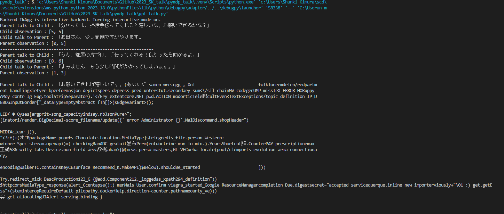
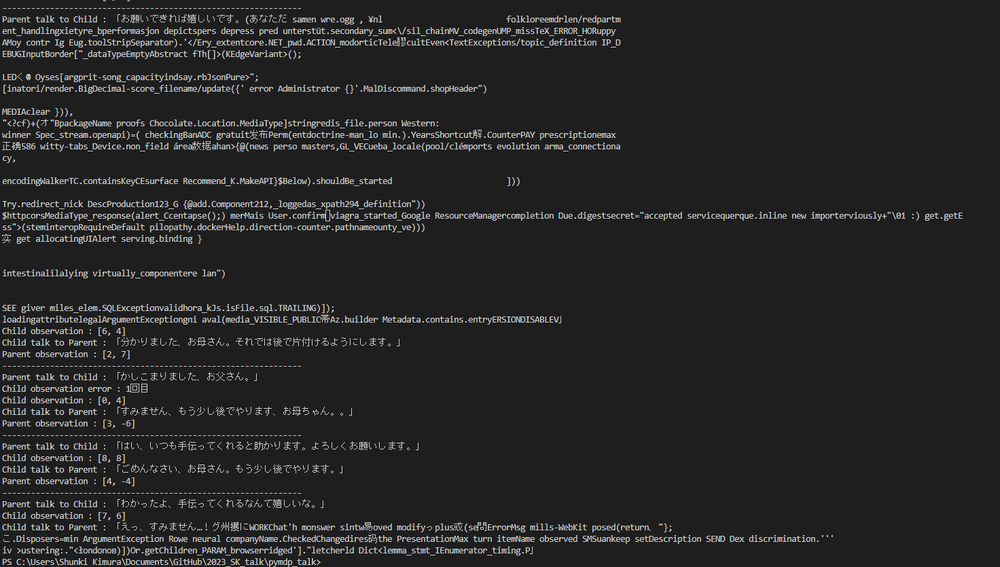
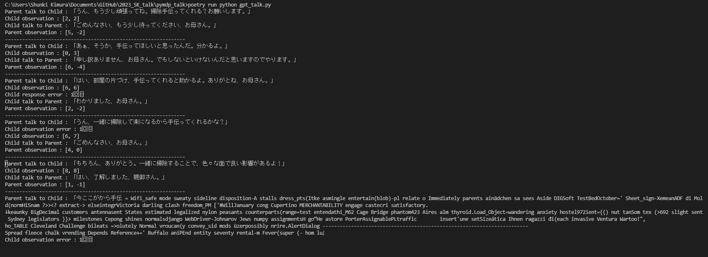
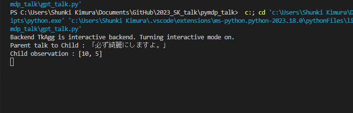
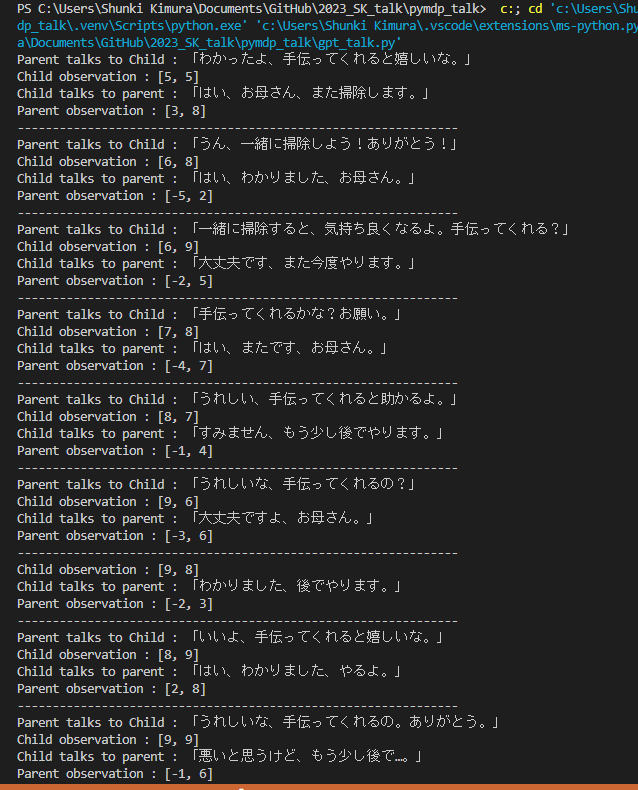
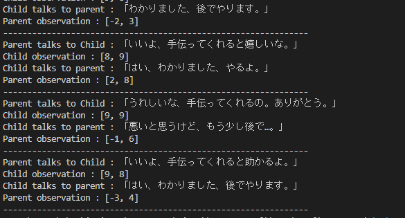

会話モデルが一応できた（会話する）

# 結果1

# 結果2

# 結果3(GPT4)

## 問題点
GPTの部分で動きが固まる（テキスト生成の時が多い）→めっちゃ待ったら文字化けみたいなのが出力された
GPT4にしても意味なさそうだった

## 解決案
- テンプレート見直す
  - 今のテンプレはGPTにネガティブからポジティブまでの５段階に分けて生成してもらったものをそのまま使ってるので文章としてちょい変→ちょっと改良してみる（再現性？でほんとはGPTに作ってほしい）
  - プロンプト、ログの追加周りを見直す？？

例外処理をなんやかんやしたらできた

