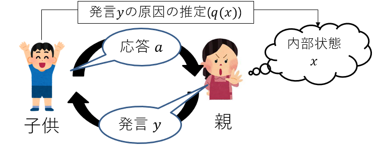
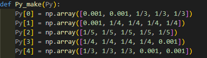
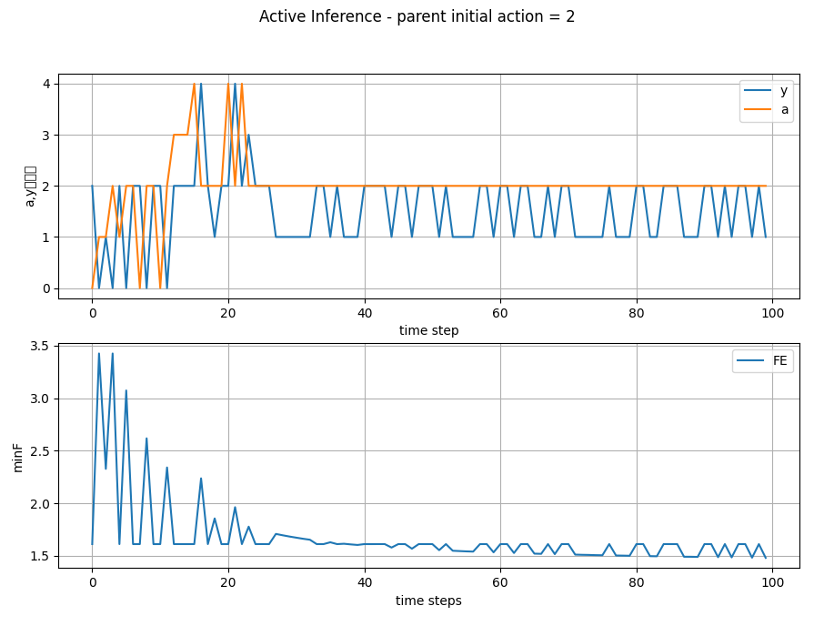

# 特課研
このフォルダは夏の発表時に作成した親子の会話デモをまとめたものである。
以下詳細を簡単に記述する。

## 状況設定
子供と親の１対１での会話シーンを想定する。具体的には親が子供に対して命令を行い、それに対する子供の応答を能動推論を用いて決定する。親の命令は別の関数で決められるものとする。

## 変数
- 隠れ状態 $x$ : 親の感情,0~4の５段階の離散値で表現される。
- 観測信号 $y$ : 親の発言,0~4の５段階の離散値で表現される。
- 行動     $a$ : 子供の応答,0~4の５段階の離散値で表現される。

## 分布
- $P(y|x,a)$ :shape = (5, 5, 5), すべての値が0.2
- $Q(x|a)$ : shape = (5, 5, 100), 期待値$x$,分散0.4の正規分布を100分割
- $P(\tilde{y})$ : shape = (5, 5), yの値ごとに設定

- $q(y|a) = \sum_x p(y|x)q(x)$
- $q(x|y,a) = \dfrac{p(y|x,a)q(x,a)}{q(y|a)}$

## EFE
- epistemic value : $\sum_y q(y|a) \sum_x q(x|y,a)log\left(\dfrac{q(x|y,a)}{q(x|a)}\right)$
- predicted surprised : $- \sum_y q(y|a)log(\tilde{y})$
- EFE = - (epistemiv value) + (predicted surprised)

## 親の設定
$a = y + f(x) + \sigma$
$x = \alpha g(y) + (1 - \alpha) x$

- $y$ : 子供の応答,0~4の5段階
- $x$ : 親の感情,[-0.5, 4.5]の連続値
- $a$ : 親の行動(発言),0~4の離散値
- $\sigma$ : [-0.5, 0.5]の乱数
- $\alpha$ : $x$の更新率(0.2に設定)
- $f(x)$ : $x$を[-0.5, -0.3, 0, 0.3, 0.5]の離散値に変換
- $g(y)$ : $y$を[-2, -1, 0, 1, 2]の離散値に変換

## 結果
